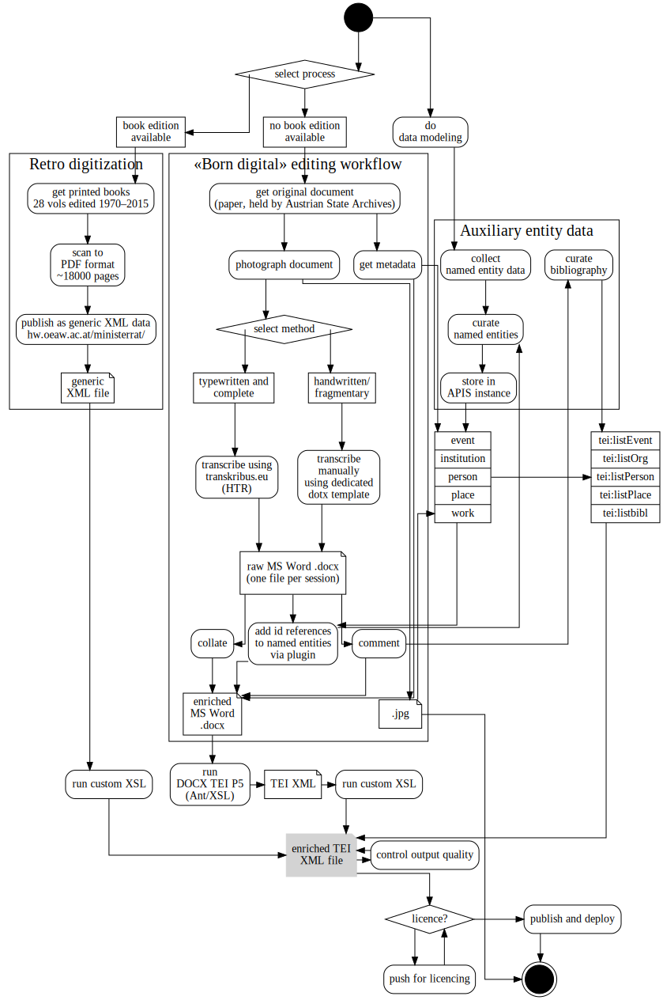
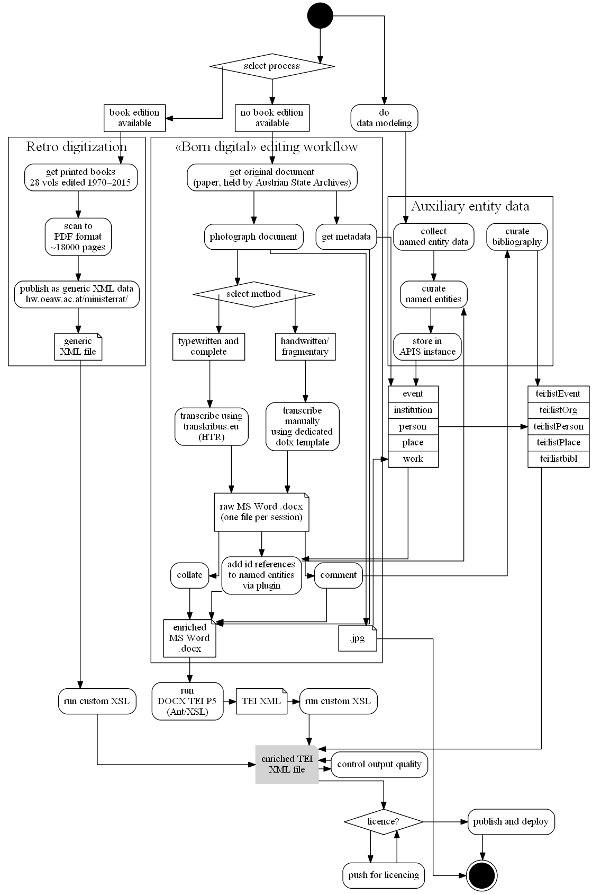
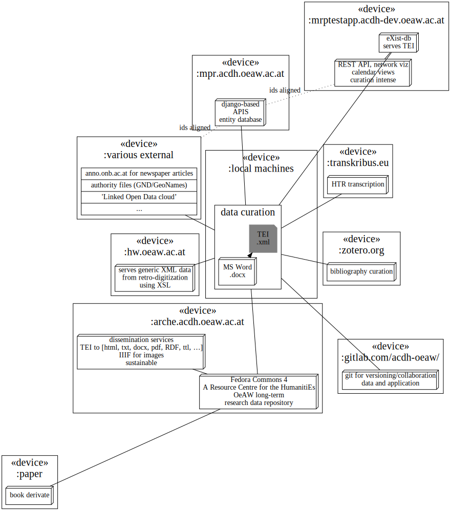
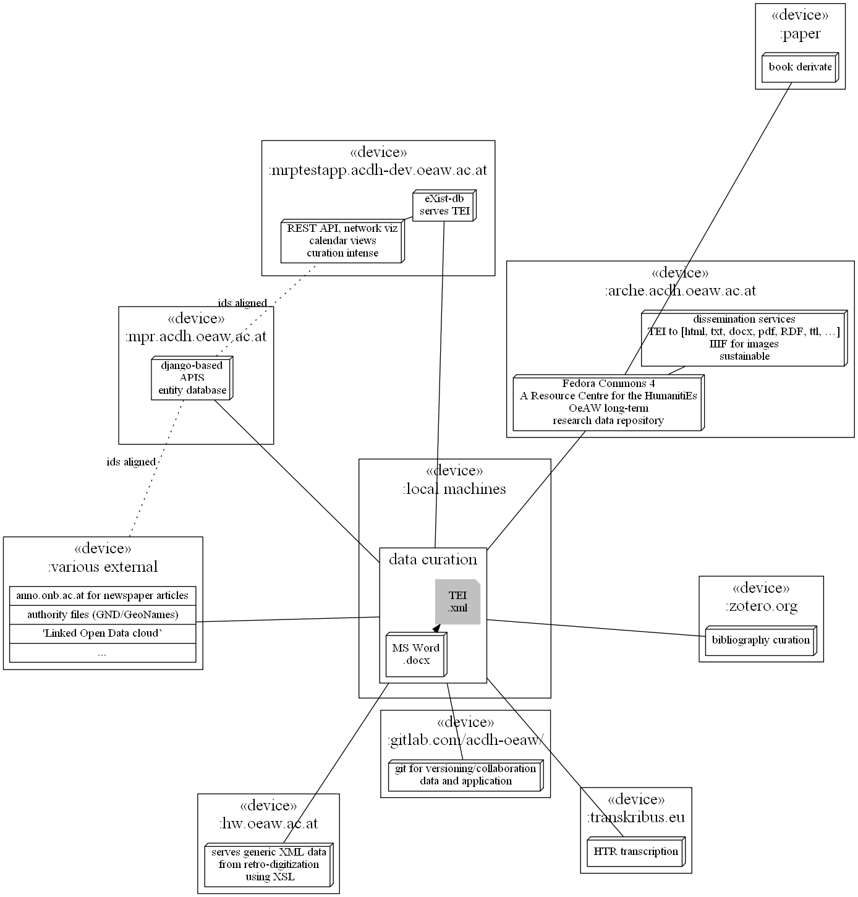

## Ministerratsprotokolle 1848–1918

### Event-based Modelling of a Major Historical Government Source 

@snap[south span-100 text-06]
Wladimir Fischer-Nebmaier, Stephan Kurz,
Austrian Academy of Sciences
@snapend
---

## What and why

- Scholarly Print Edition > Digital Scholarly Edition
- Historical documents (https://oesta.gv.at/)
- Long-term project of AAS
- Mapping the past to understand the present

---

## Contents

- 1848 to 1867 (retro-digitized)
- 1867 to 1918 (in the works, "born digital")
- everything the government discussed
  - from individual pensions, orders …
  - … to railway lines, founding of universities …
  - … crises and wars

---

## Open data

- but for historical records 
  - (that otherwise go unnoticed even in large parts of the history research)
- "Digital Humanities" methods
- "Findable, Accessible, Interoperable, and Re-usable"

---

## Methods

---

### Transcription and Linking

- .docx for transcription
- TEI XML ~standard markup
  - auxiliary entity data
  - LOD connection

---

### Tools/stack

- Word/Git/XSL/eXist-db
- Zotero/bibsonomy
- APIS as prosopographical information system

---

### APIS

- Simple data model
  - person
  - place
  - institution
  - work
  - event
  
see <https://mpr.acdh-dev.ac.at>

---

### tei:event

- Joint paper with C Fritze (onb.ac.at) / H W Klug (uni-graz.at)
- diary of Andreas Okopenko (Austrian writer)
- medieval calendar 
- medieval itineraries
- find ways to tag and disseminate DSE `event` data
- **goal:** making DSE more findable and more linkable, reusable
  - calendar widget 

--- 

### event

- as "graph" relating S/P/O resulting in change of state
- as a Named entity (missing `tei:eventName` || to `(pers|place|org)Name`
- extending TEI P5 Guidelines 
- MRP as one more usecase
- https://mrptestapp.acdh-dev.oeaw.ac.at/

---

## Deployment ecosystem

---

## Published Tools and Sources

- https://hw.oeaw.ac.at/ministerrat/
- https://mrptestapp.acdh-dev.oeaw.ac.at/
- https://github.com/skurzinz/mrptestapp/
- https://github.com/skurzinz/mrptestdata/
- https://github.com/skurzinz/mrpbiblio/
- https://gitpitch.com/skurzinz/INFuture2019-slides/

---

## Go use it

liberate some more history data.

@snap[south span-100 text]
feedback and/or contribution is always welcome.
@snapend
